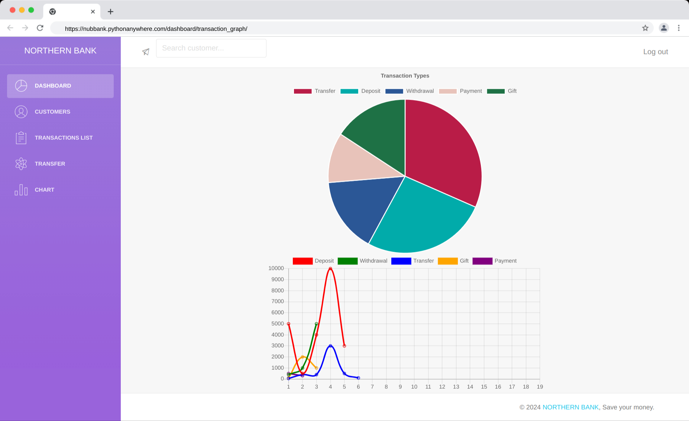

# Project Feature:
1. User can login to the dashboard.
2. Bank Manager can manage Bank
3. Transaction Manage:
    - Deposit
    - Withdraw
    - Transfer
    - Payment
    - Gift
4. User can see the transaction history.
5. User can see the balance.
6. User can see the profile.
7. User can update the profile.
8. Bank manager can see Graphical representation of the transaction.
9. Bank manager can see the total transaction amount.
10. Bank manager can see the total user.
11. New user can register.
12. Pagination for the transaction history.


## Technologies used:
1. Python
2. Django
3. HTML
4. CSS
5. Bootstrap
6. JavaScript
7. PostgreSQL/SQLite/MySQL


# Screenshot of the project
## Dashboard Page:


## Transaction Chart:


## Home Page:


# Sign In Page:


## How to run the project:

1. Clone the repository or download the zip file.
2. Create a virtual environment and activate it with required dependencies.

4. Create a `.env` file in the root directory of the project and add the following lines:

    ```
    SECRET_KEY=your_secret_key
    DEBUG=True
    ```
    Replace `your_secret_key` with a secret key.
    you cna follow the example file `.env-example` to create the `.env` file.

6. Run the following command to initialize the database and create the superuser:

    ```
    python manage.py init
    ```

    Note: This command will create the database and create the superuser with the following credentials:
    `username:admin@gmail.com` `password:admin`
    and also create the bank which is required to perform the transaction.Named as `Northen Bank`.
    and initial deposit of 1000000 to the bank. which is required to perform the transaction.


## Contributors

[](https://github.com/iamfoysal)  [](https://github.com/itsmohiful)[](https://github.com/HelloSunnah)[](https://github.com/jahanrothy)